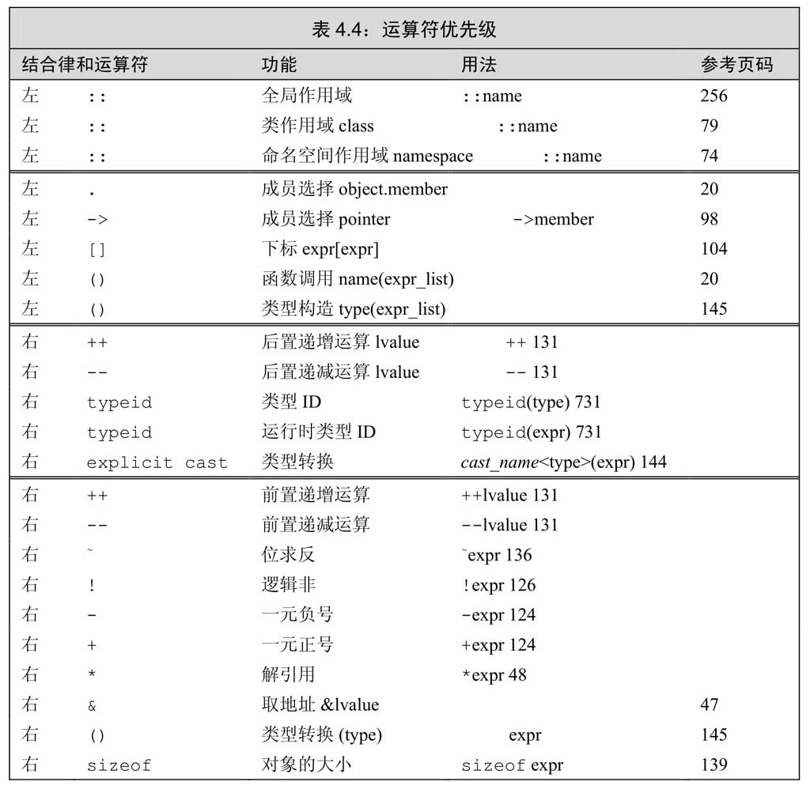
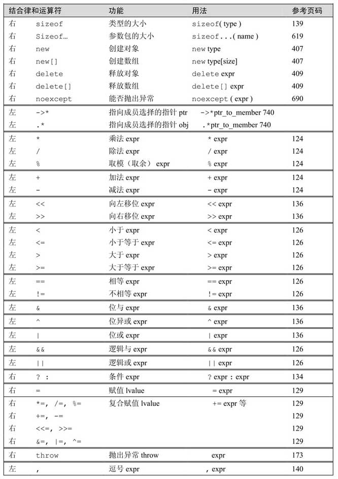

《C++ Primer》学习笔记
<!--more-->

# C++ Primer
## 2. 变量和基本类型
### 基本内置类型
基本数据类型：
- **算数类型**(arithmetic type)
- **空类型**(void)

### 算数类型
- **整型**(integral type)
  - 布尔类型(bool)：true或false
  - 字符类型(char)：大小和机器字节一样
  - int
  - short
  - long
  - long long
- **浮点型**
  - float：1个字(32比特)
  - double：2个字(64比特)
  - long double：3或4个字(96或128比特)

### 类型转换
当在程序的某处我们使用了一种类型而其实对象应该取另一种类型时，程序会自动进行类型**转换**(convert)。

- 非布尔→布尔：
  - 0→false
  - 非0→true
- 布尔→非布尔：
  - false→0
  - true→1
- 浮点→整型：
  - 仅保留小数点之前的部分
- 整型→浮点：
  - 小数部分记为0
- 超出无符号类型表示范围的值→无符号类型：
  - 初始值→初始值对无符号类型表示数值类型取模后的余数
- 超出带符号类型表示范围的值→带符号类型
  - 结果**未定义**(undefined)

当在程序某处使用了一种算数类型的值而其实所需的是另一种类型的值，编译器同样会执行类型转换：
```cpp
int i = 42;
if(i)      //条件的值变为true
    i = 0;
```

###  变量
### 变量定义
基本形式：**类型说明符**(type specifier) 变量名1 = 值, 变量名2, 变量名3 = 值；

**对象** 一块能存储数据并具有某种类型的内存空间。

**初始化** 在创建变量时赋予其一个初始值；
**赋值** 把对象的当前值擦除，以一个新值来替代。

初始化的形式：
```cpp
int units_sold = 0;
int units_sold = {0};
int units_sold{0};
int units_sold(0);
```
用花括号初始化变量称为**列表初始化**(list initialization)，使用列表初始化且初始值存在丢失信息的风险时，编译器报错：
```cpp
int a = {3.14};     //报错，存在丢失信息风险
int a = (3.14);     //不报错，直接丢失信息
```

**默认初始化**(default initialized) 定义于任何函数体之外的未被显式初始化的**内置变量**被初始化为0；
**不被初始化**(unintialized) 定义在函数体内部的内置变量将不被初始化，其值是未定义的。

### 声明和定义
**声明**(declaration) 使得名字为程序所知，一个文件如果想使用别处定义的名字则必须包含对那个名字的声明；
**定义**(definition) 负责创建与名字关联的实体。
变量只能被定义一次，但是可以被多次声明。

```cpp
extern int i;   //声明i而非定义i
int j;          //声明并定义j
```

### 标识符
C++的**标识符**(identifier)由字母、数字和下划线组成，必须以字母或下划线开头。长度没有限制，但对大小写敏感。

**命名规范**
- 标识符能体现实际含义；
- 变量名一般用小写字母；
- 用户自定义的类名一般以大写字母开头；
- 如果标识符由多个单词组成，单词间应有明显区分。(如student_loan或studentLoan)

### 作用域
**作用域** 程序的一部分，在其中名字有其特定的含义。名字的有效区域始于名字的声明语句，以声明语句所在的作用域末端为结束。

### 复合类型
**复合类型**(compound type)是指基于其他类型定义的类型。
- 引用
- 指针

**引用**(reference)为对象起了另一个名字，引用类型引用另外一种类型。
- 引用必须初始化，且会一直和它的初始值对象绑定在一起；
- 定义引用时，程序把引用和初始值*绑定*在一起，而不是拷贝；
- 引用并非对象，只是已存在对象的另外一个名字。
```cpp
int ival = 1024;
int &refVal = ival;
reVal = 2;        //相当于把2赋给ival
int ii = refVal;  //相当于ii = ival
```
**指针**(pointer)是指向(point to)另外一种类型的复合类型。
- 指针本身是一个对象，允许对指针赋值和拷贝，在指针的生命周期内它可以先后指向几个不同的对象；
- 指针无需在定义是赋初值。

**取地址符&** 获取对象的地址。
```cpp
int ival = 42;
int *p = &ival; //p存放ival的地址
```

**解引用符\*** 访问指针指向的对象。
```cpp
//接上
std::cout << *p;  //输出ival的值42
```

**空指针**(null pointer) 不指向任何对象的指针。使用字面值nullptr（避免使用NULL）。

**void\* 指针** 特殊的指针类型，可用于存放任意对象的地址。不能直接操作void\*指针所指的对象。

**定义多个变量**
```cpp
int* p1, p2;    //p1是指向int的指针，p2是int
int *p1, *p2;   //p1和p2都是指向int的指针
```

**指向指针的指针** 通过\*的个数可以区分指针的级别。
```cpp
int ival = 1024;
int *pi = &ival;
int **ppi = &pi;    //ppi指向一个int型指针
std::cout << **ppi; //进行两次解引用，输出ival的值
```

**指向指针的引用** 
```cpp
int i = 42;
int *p;
int *&r =p; //r是指针p的引用
r = &i;     //相当于令p指向i
*r = 0;     //将i的值改为0
```

### const限定符
**关键字const** 对变量的类型加以限定，令变量的值不能被改变。
- const对象必须初始化，一旦创建后其值就不能再改变。

默认状态下，const对象仅在文件内有效。
```cpp
const int bufSize = 512;
```
编译器在编译时会把文件中所有用到bufSize的地方用512替换。

**extern关键字** 使const变量能被其他文件访问。
```cpp
//在file.cpp中
extern const int bufSize = 512;   //定义并初始化bufSize

//在其他文件中
extern const int bufSize;         //与file.cpp中的bufSize为同一个
```

**const的引用**
```cpp
const int ci = 1024;
const int &r1 = ci;   //正确
int &r2 = ci;         //错误
```

**指向常量的指针**(pointer to const) 令指针指向常量，**不能用于改变其所指对象的值**。存放常量对象的地址只能用指向常量的指针。
```cpp
const double pi = 3.14;
double *ptr = &pi;        //错误
const double *cptr = &pi; //正确，cptr为指向常量的指针
const double const *ccptr;//ccptr为指向常量对象的常量指针
```

**常量指针**(const pointer) 把指针本身定为常量，必须初始化且**初始化完成后指针的值就不能再改变**。（不能改变指针的指向）
```cpp
int errNumb = 0;
int *const curErr = &errNumb;   //curErr一直指向errNumb
```

**顶层const**(top-level const) 表示指针本身（对象本身）是个常量；
**底层const**(low-level const) 表示指针所指的对象是一个常量。

**常量表达式**(const expression) 指值不会改变并且在编译过程就能得到计算结果的表达式。

**constexpr类型** 将变量声明为constexpr类型以便由编译器来验证变量的值是否一个常量表达式。constexpr变量一定是是一个常量，而且必须用常量表达式初始化。
```cpp
constexpr int mf = 20;
constexpr int limit = mf + 1;
constexpr int sz = size();    //只有当size是一个constexpr函数时才是一条正确的声明语句
```

**指针和constexpr** 在constexpr声明中如果定义了一个指针，限定符constexpr仅对指针有效，与指针所指对象无关。
```cpp
const int *p = nullptr;     //p是一个指向整型常量的指针
constexpr int *q = nullptr; //q是一个指向整数的常量指针
```


### 处理类型
**类型别名**(type alias) 是一个名字，是某种类型的同义词。
```cpp
typedef double wages;
typedef wages base, *p;   //base是double的同义词，p是double*的同义词
```

**别名声明**(alias declaration)
```cpp
using SI = Sales_item;  //SI是Sale_item的同义词
```
```cpp
typedef char *pstring;
const pstring cstr = 0;   //cstr是指向char的常量指针
//不等价于
const char *cstr = 0;     //cstr是指向const char的指针
```

**auto类型说明符** 让编译器自动分析表达式所属的类型。auto定义的变量必须有初始值。
- 可以使用auto在一条语句中声明多个变量，该语句中所有变量的初始基本数据类型必须一样；
- auto一般会忽略掉顶层const，保留底层const。

**decltype类型说明符** 选择并返回操作数的数据类型。
```cpp
decltype(f()) sum = x;  //sum的类型为函数f()的返回类型
```

- decltype对引用类型的变量使用时返回引用类型。

```cpp
int i = 42, &r = i;
decltype(r) x = i;  //x为int&型，绑定在i上  
decltype(r + 0) y;  //y为int型

//变量名加括号类型会变成引用
decltype((i)) d;    //错误，d为int&，需要初始化
decltype(i) e;      //正确，e为未初始化的int
```

### 自定义数据结构

定义Sales_data类型:
```cpp
struct Sales_data {
  std::string bookNo;
  unsigned unites_sold = 0;
  double revenue = 0.0;
};    //记得加分号！！！
```

**预处理器**(preprocessor) 在编译之前执行一段程序，可以部分地改变我们所写的程序。可以确保头文件多次包含仍能安全工作。

**预处理变量**
- **#define**：把一个名字设定为预处理变量；
- **#ifdef...#endif**：当且仅当变量已定义时为真；
- **#ifndef...#endif**：当切仅当变量为定义时为真。


## 3. 字符串、向量和数组

### 命名空间
**作用域操作符"::"** 告知编译器应从操作符左侧名字所示的作用域中寻找右侧那个名字。

**using声明**(using declaration) 无需专门的前缀也能使用所需的名字。
```cpp
using namespace::name;
```
- 用到的每个名字欧必须有自己的声明语句，而且每句话都得以分号结束；
- 头文件不应包含using声明，避免使用头文件时产生名字冲突。

### 标准库类型string
**string**表示可变长的字符序列，定义在string头文件与命名空间std中。
```cpp
#include <string>
using std::string;
```

string的**初始化**：

| 代码                | 含义                                                  |
| :------------------- | :----------------------------------------------------- |
| string s1           | 默认初始化，s1是一个空串                              |
| string s2(s1)       | s2是s1的副本                                          |
| string s2 = s1      | 等价于s2(s1)，s2是s1的副本                            |
| string s3 ("value") | s3是字面值"value"的副本，除了字面值最后的那个空字符外 |
| string s3 = "value" | 等价于s3("valve")，s3是宇面值"value"的副本            |
| string s4 (n, 'c')  | 把s4初始化为由连续n个字符c组成的串                    |

**拷贝初始化**(copy initialization) 使用等号初始化一个变量，编译器把等号右侧的初始值拷贝到新创建的对象中去；
**直接初始化**(direct initialization) 不使用等号。
```cpp
string s5 = "hiya";   //拷贝初始化
string s6("hiya");    //直接初始化
string s7(10, 'c');   //直接初始化
string s8 = string(10, 'c')； //直接初始化，不过需要创建一个临时对象，不如s7
```

**读写string对象** 
- 使用**IO操作符**(cin/cout)
  - 执行读取操作(cin)时，string对象会自动忽略开头的空白，从第一个字符读起，知道下一处空白。
- 使用**getline函数**
  - 从给定的输入流读入内容，直到换行符，但不存换行符。

**empty函数** 根据string对象是否为空返回一个对应的bool值。使用点操作符执行。
```cpp
if(!str.empty())
    cout << str << endl;
```

**size函数** 返回string的长度，是一个**无符号**整型数，类型为**size_type**。
```cpp
auto len = str.size();
```

**比较string对象** 使用==、!=、<、<=、>、>=。

**两个string对象相加** +运算符返回一个string对象，为+左边的字符后面串接上+右边的字符。
- +的一侧可以为字面值(如"abcde")，但另一侧一定要为string对象，不能直接把字面值相加。

**处理字符串的每个字符** 使用**范围for**(range for)语句。
```cpp
string str("some string");
for (auto c : str)
    cout << c << endl;
```

**改变string对象中字符的值** 把范围for语句中的循环变量定义改成引用类型。
```cpp
//把s中的小写变为大写
string s("Hello World!");
for(auto &c : s)
    c = toupper(c);
cout << s << endl;
```

**下标访问string** string对象的下标大于等于0小于s.size()。

### 标准库类型vector
**vector** 表示对象的合集，其中所有对象的类型都相同，也被称作容器(container).
```cpp
#include <vector>
using std::vector;
```
```cpp
vector<int> ivec;               //ivec保存int类型对象
vector<Sales_item> Sales_vec;   //保存Sales_item类型对象
vector<vector<string>> file;    //向量元素为vector对象
```

vector的**初始化**

| 代码                        | 含义                                                    |
| :--------------------------- | :------------------------------------------------------- |
| vector<T> vl                | v1是一个空vector，它潜在的元素是T类型的，执行默认初始化 |
| vector<T> v2 (v1)           | v2中包含有v1所有元素的副本                              |
| vector<T> v2 = v1           | 等价于v2(v1)，v2中包含有 v1所有元素的副本               |
| vector<T> v3(n, val)        | v3包含了n个重复的元素，每个元素的值都是 val             |
| vector<T> v4(n)             | v4包含了n个重复地执行了值初始化的对象                   |
| vector<T> v5{a, b, c... }   | v5包含了初始值个数的元素，每个元素被赋予相应的初始值    |
| vector<T> v5 = {a, b, c...} | 等价于 V5{a,b,c...}                                     |

**花括号和圆括号**
- 花括号
  - 提供多个值，进行列表初始化
  - 提供单个值，且该值可以用来列表初始化，容器只有一个元素
  - 提供单个值，但该值不能用来列表初始化，容器有该值数量的元素
- 圆括号
  - 提供两个值，第一个值为元素数量，第二个值为元素的值
  - 提供单个值，容器有该值数量的元素

**向vector对象中添加元素** 使用**push_back**成员函数。

**其他的vector操作**
```cpp
v.empty()
v.size()
v.push_back(t)
v[n]
v1 = v2
v1 = {a, b, c...}
v1 == v2
v1 != v2
<, <=, >, >=
```

**使用范围for处理vector对象**
```cpp
vector<int> v{1,2,3,4,5,6,7,8,9};
for(auto &i : v)
    i *= i;
for(auto i : v)
    cout << i << " ";
cout << endl;
```

### 迭代器
**迭代器**(iterator) 提供对对象（容器中的元素或string中的字符）的间接访问。

**begin** 返回指向第一个元素的迭代器。
**end** 返回指向尾元素的下一个位置(one past the end)的迭代器。被称为*尾后迭代器*(off-the-end iterator)或*尾迭代器*(end iterator)。

迭代器的**运算符**：
```cpp
*iter
iter->mem   //解引用并获取名为mem的成员
(*iter).men //同上
++iter
--iter
iter1 == iter2 
iter1 != iter2
iter + n
iter -n
iter1 += n
iter1 -= n
iter1 - iter2
>、>=、<、<=
```

**迭代器类型**
```cpp
vector<int>::iterator it;   //it能读写vector<int>的元素
string::iterator it1;       //it2能读写string对象中的字符

vector<int>::const_iterator it3;  //it3只能读元素，不能写元素
string::iterator it4;       //it4只能读字符，不能写字符
```

### 数组
- 数组定义时的维度必须是一个常量表达式(constexpr)；
- 定义数组的时候必须指定数组的类型，不允许用auto关键字；
- 不能将数组的内容拷贝给其他数组作为其初始值，也不能用数组为其他数组赋值
```cpp
unsigned cnt = 42;
constexpr unsigned sz = 42;
int arr[10];      //正确
int *parr[sz];    //正确
string bad[cnt];  //错误
```

**标准库函数begin和end**
```cpp
int ia[] = {0,1,2,3,4,5,6,7,8,9};
int *beg = begin(ia);   //指向ia首元素
int *last = end(ia);    //指向ia为元素的下一位置的指针
```

**C风格字符串** 在字符串的最后一个字符后面跟着一个空字符('\0')。
在C++中最好不要使用。

**C标准库String函数** 定义在cstring头文件中。（c++版本的string.h）
```cpp
strlen(p)       //返回长度，不包含空字符
strcmp(p1, p2)  //比较p1和p2的相等性
strcat(p1, p2)  //将p2附加到p1之后，返回p1
strcpy(p1, p2)  //将p2拷贝给p1，返回p1
```

**混用string对象和C风格字符串**
- 允许使用以空字符结束的字符数组来初始化string对象或为string对象赋值；
- 在string对象的加法运算中允许使用以空字符结束的字符数组作为其中一个运算对象；
- 在string对象的复合赋值运算中允许使用以空字符结束的字符数组作为右侧的运算对象。

**c_str函数** 返回一个C风格的字符串
```cpp
std::string s{"abcde"};
char *str = s;  //错误
const char *str = s.c_str();  //正确，但在改变了s之后str的内容也会跟着改变
```

**使用数组初始化vector对象**
```cpp
int int_arr[] = {0,1,2,3,4,5};
vector<int> ivec(begin(int_arr), end(int_arr));
```

### 多维数组
**多维数组** 本质为数组的数组。

**多维数组的范围for**
使用范围for处理多维数组，除了最内层的循环外，其他所有循环的控制变量都应该是引用类型。（要进行写操作时最内层也要为引用类型）
```cpp
//ia为二维数组
for(auto row : ia)
    for(auto &col ; row) {
        cout << col << endl;
```

## 4. 表达式
### 运算符
- **一元运算符**(unary operator) 作用于一个运算对象，&、*（解引用）等；
- **二元运算符**(binary operator) 作用域两个运算对象，==、*（乘法）等；
- **三元运算符** 条件运算符 ? :
- **函数调用** 对运算对象的数量没有限制。

**重载运算符**(overloaded operator) 为已存在的运算符赋予另外一层含义。如IO库的>>和<<、string对象、vector对象和迭代器使用的运算符。

**复合表达式**(compound expression) 指含有两个或多个运算符的表达式。根据优先级和结合律决定运算对象的组合方式。



**明确规定求值顺序的运算符**
- 逻辑与(&&)，当且仅当左侧运算对象为**真**时才对右侧运算对象求值；
- 逻辑或(||)，当且仅当左侧运算对象为**假**时才对右侧运算对象求值；
- 条件(?: )，当条件为真时求:左侧表达式的值，条件为假时求:右侧表达式的值；
- 逗号(,)，首先对左侧的表达式求值，然后将求值结果丢弃掉，真正结果是右侧表达式的值。

**%运算符** 取余，参与取余的对象必须是整数类型。

**商为负数** C++11规定商一律向0取整（直接切除小数部分）。

**给赋值运算假括号** 赋值语句经常会出现在条件当中，因为赋值运算优先级较低，通常要给赋值部分加上括号。
```cpp
int i;
while((i = get_value()) != 42) {
      ...;
}
```

**递增、递减运算符**
如果不需要修改前的值，则使用前值版本，避免浪费和不必要的工作。
- 前置：++i，返回递增之后的值，将对象本身作为左值返回；
- 后置：i++，返回递增之前的值，将对象原始值的副本作为右值返回。

**成员访问运算符** 
- **点运算符**：获取类对象的一个成员；
- **箭头运算符**：作用于指针对象，相当于解引用后再访问成员。
```cpp
string s1 = "a string", *p = &s1;
auto n = s1.size();
n = (*p).size();
//等价于
n = p->size();
```

**嵌套条件运算符** 允许在条件运算符的内部嵌套 另外一个条件运算符。
```cpp
//将成绩分成三档
finalGrade = (grade > 90) ? "high pass"
                          : (grade < 60 ) ? "fail" : "pass";
```

### 位运算符
作用于整数类型的运算对象，并把运算对象看成是二进制位的集合。如果运算对象为“小整形”，则它的值会被自动提升成较大的整数类型。

**位移运算符**
- **左移运算符(<<)** 在右侧插入值为0的二进制位；
  - 左移动一位，若被舍弃的高位不为1，相当于乘以2
- **右移运算符(>>)** 取决于左侧运算对象的类型
  - 运算对象为无符号类型，再左侧插入值为0的二进制位；
  - 运算对象为带符号类型，再左侧插入符号位的副本或值为0的二进制位。
  - 右移一位，相当于除以2


**位求反运算符(~)** 将运算对象逐位求反后生成一个新值，将0置为1，将1置为0。

**位与、位或、位异或运算符**
- 位与运算符(&)
- 位或运算符(|)
- 位异或运算(^)

### sizeof()运算符
返回一条表达式或一个类型名字所占的字节数。所得的值是一个size_t类型的常量表达式。

```cpp
sizeof(type);   //返回类型的大小

sizeof expr;    //返回表达式结果类型的大小
                //但并不实际计算其运算对象的值

sizeof *ptr;    //返回指针所指类型的空间大小
                //即使该指针是无效指针仍为安全行为
                
sizeof array;   //返回整个数组所占空间的大小
```

### 类型转换
**相互转换**(conversion) 某些类型之间有关联，可以相互转换。

**隐式转换**(implicit conversion) 自动执行的类型转换，无须程序员的介入。

**算术转换**(arithmetic conversion) 把一种算数类型转换成另一种算数类型。
- **整型提升**(integral promotion) 负责把小整数类型转换成较大的整数类型。
  bool、char 、unsigned char、short、unsigned short → int

**强制类型转换**(cast) 

命名的强制类型转换:
- **static_cast** 进行不包含底层const的具有明确定义的类型转换；
```cpp
int i, j;
double slope = static_cast<double>(j) / i;
```
- **dynamic_cast** 只能够用在指向类的指针或者引用上；
- **const_cast** 只能改变运算对象的底层const；
```cpp
const char *pc;
char *p = const_cast<char*>(pc);	//正确，但是通过p来写值是未定义的
```
- **reinterpret_cast** 为运算对象的位模式提供较低层次上的重新解释，能够完成任意指针类型向任意指针类型的转换，即使它们毫无关联。

## 5. 语句

**空语句**(null statement) 空语句中只有一个单独的分号。
```cpp
while(cin >> s && s != sought)
    ;   //空语句
```
使用空语句时应该加上注释。

多余的空语句并非总是无害的：
```cpp
while(iter != svec.end()) ;
    ++iter;
```

**悬垂else**(dangling else) 指当程序中的if分支多于else分支时，如何为else寻找与之匹配的if分支的问题。

C++规定，else与离它最近的尚未匹配的if匹配，从而消除了二义性。

**switch的内部变量定义**
如果要为某个case分支定义并初始化一个变量，我们应该把变量定义在块内，从而确保后面的所有case标签都在变量的作用域之外。
```cpp
case true:
    {
        string file_name = get_file_name();
    }
    break;
case false:
    if(file_name.empty())   //错误，file_name不在作用域之内
```

**范围for语句**
```cpp
for(declaration : expression)
    ststement
```
expression必须要为一个序列，拥有能返回迭代器的begin和end成员。（如花括号括起来的初始值列表、数组、或者vector或string等类型的对象）

declaration定义一个变量，序列中的每个元素都得能转换成该变量的类型。

**do while语句**
do while语句先执行循环体后检查条件，不管条件的值如何，都至少执行一次循环。
```cpp
do
    statement
while(condition);   //condition使用的变量必须定义在循环体之外
```

### 跳转语句
- break
- continue
- goto
- return

**break语句** 负责终止离他最近的while、do while、for或switch语句，并从这些语句之后的第一条语句开始继续执行。

**continue语句** 终止最近的循环当中的当前迭代并立即开始下一次迭代。只能出现在for、while、do while循环的内部。
- 对于传统for：继续执行for语句头的expression；
- 对于范围for：用序列的下一个元素初始化循环控制变量。

**goto语句** 从goto语句无条件跳转到同一函数内的另一条语句。（不建议使用）


### try语句快和异常处理
- **throw表达式** 使用throw表达式进行异常检测，表示遇到无法处理的问题；
- **try语句块** 处理异常，以关键字try开始，并以一个或多个catch子句结束，也被称作*异常处理代码*(exception handler)；
- **一套异常类**(exception class) 用于在throw表达式和相关的catch子句之间传递异常的具体信息。

**throw表达式** 
包含关键字throw和紧随其后的一个表达式，表达式的类型就是抛出的异常类型。
```cpp
//如果ISBN不一样就抛出一个异常
if(item1.isbn() != item2.isbn())
    throw runtime_error("Data must refer to same ISBN");
```
抛出异常将终止当前的函数，并把控制权转移给能处理该异常的代码。

**try语句块**
```cpp
try {
    program-statements
} catch (exception-declaration) {
    handler-statements
} catch (exception-declaration) {
    handler-statements
}
```
catch子句包括：
- catch关键字
- 括号内一个对象的声明（称作**异常声明**，exception declaration）
- 一个块

**标准异常** 用于报告标准库函数遇到的问题的异常类分别定义在4个头文件中：
- exception头文件：定义了最通用的异常类，只报告异常的发生，不提供任何额外信息；
- stdexcept头文件：定义了几种常用的异常类

| 异常名           | 说明                                           |
| :---------------- | :---------------------------------------------- |
| exception        | 最常见的问题                                   |
| runtime_error    | 只有运行时才能检测出的问题                     |
| range_error      | 运行时错误：生成的结果超出了有意义的值域范围   |
| overflow         | 计算上溢                                       |
| underfolw_error  | 计算下溢                                       |
| logic_error      | 程序逻辑错误                                   |
| domain_error     | 逻辑错误：参数对应结果值不存在                 |
| invalid_argument | 逻辑错误：无效参数                             |
| length_error     | 逻辑错误：试图创建一个超出该类型最大长度的对象 |
| out_of_range     | 逻辑错误：使用一个超出有效范围的值             |

- new头文件：定义了bad_alloc异常类型
- type_info头文件：：定义了bad_cast异常类型

**what函数** 异常类型定义的成员函数，函数没有参数，返回值是一个指向C风格字符串的const char*。提供关于异常的一些文本信息。


## 6. 函数

### 函数基础
**函数组成**
- 返回类型(return type)
- 函数名字
- 由0个或多个形参组成的列表
- 函数体

**函数调用**
1. 用实参初始化函数对应的形参
2. 将控制权转移给被调用函数

**return语句**
1. 返回return语句中的值
2. 将控制权从被调函数转移回主调函数

**参数列表**
- 定义不带形参的函数；
```cpp
void f1() { /* ... */ }       //隐式定义空形参列表
void f2(void) { /* ... */ }   //显式定义，为了兼容C语言
```

- 标明每个形参的类型；
```cpp
int f3(int v1, v2) {}       //错误
int f4(int v1, int v2) {}   //正确
```
- 任意两个形参不能同名；
- 函数最外层作用域中的局部变量不能使用与函数形参一样的名字。

**返回类型**
- void返回类型：表示函数不返回任何值；
- 不能返回数组类型或函数类型，可以返回指向数组或函数的指针。

**名字的作用域** 名字在其中可见的程序文本的部分；
**对象的生命周期** 程序执行过程中对象存在的时间。

**自动对象**(automatic object) 只存在于块执行期间的对象。当块的执行结束后，块中创建的自动对象的值就变成为定义的了。（形参为一种自动对象）

**局部静态对象**(local static object) 用**static**来定义，在程序第一次经过对象定义语句时初始化，并且直到程序终止才被销毁。（默认初始化为0）
```cpp
//每调用一次该函数，ctr的值就会+1
size_t count_calls() {
  static size_t ctr = 0;
  return ++ctr;
}
```

**函数声明**/**函数原型**(function prototype)
函数只能定义一次，但可以声明多次。建议把变量和函数声明在头文件中，在源文件中定义。

**分离式编译**(separate compilation) 把程序分隔到几个文件中去，每个文件单独编译。

### 参数传递
每次调用函数时都会重新创建形参，并用传入的实参对形参进行初始化。

**传值参数**
- **非引用形参**：把初始值**拷贝**给形参，形参的改动不影响初始值；
- **指针形参**：**拷贝**指针，但所指的对象一样，可以通过指针形参修改所指对象的值；
- **引用形参**：将形参**绑定**到传入的对象上，可以通过引用形参改变对象的值；
- **对常量的引用**：当传入的对象较大时，为了**避免拷贝**，可以把形参定义为对常量的引用。
```cpp
bool isShorter(const string &s1, const string &s2) {
  return s1.size() < s2.size();
}
```

**非常量引用形参的局限性**：
当函数的形参为&而不是const &时，函数不能传入常量，只能用于变量。
```cpp
//该函数只能用于string对象而不能用于字符串常量
bool is_empty(string& s) {
  return s.empty();
}
```

**数组形参** 数组不能拷贝，为函数传递一个数组时，实际上传递的是指向数组首元素的指针。
```cpp
//3个等价的函数
void print(const int*);
void print(const int[]);
void print(const int[10]);  //维度表示期望数组有多少元素，而不是实际
```

**管理指针形参** 提供额外的信息来确定数组的确切尺寸。
- **使用标记** 为数组设定一个结束标记；
- **使用标准库规范** 传递指向数组首元素和尾后元素（尾元素的下一个位置）的指针；
- **显示传递表示数组大小的形参** 传入一个size形参。

**传递多维数组** 数组的第二维的大小是数组类型的一部分，不能省略
```cpp
//matrix指向数组的首元素，数组的元素是由10个整数构成的数组
void print(int (*matrix))[10], int rowSize);
//注意不能去掉括号，去掉括号则变成10个指针构成的数组
```

**含有可变形参的函数** 当无法提前预知应该向函数传递几个实参的时候。
- **initializer_list形参** 标准库类型，用于表示某种特定类型的值的数组。定义在同名头文件中。

```cpp
void error_msg(initializer_list<string> il) {
    for(auto iter = il.begin(); iter != il.end(); ++iter)
        cout << *iter << " " ;    //也可以使用范围for
      cout << endl;
}
```

调用时将传入序列**放在花括号内**：
```cpp
//调用error_msg
error_msg({"functionX", "okay"});
```

initializer_list提供的操作:
```cpp
initializer_list<T> lst;
initializer_list<T> lst{a,b,c...};

lst2(lst)
lst2 = lst    //拷贝一个副本，但原始列表和副本共享元素

list.size()
lst.begin()
lst.end()
```

- **省略符形参** 为了便于C++程序访问某些特殊的C代码而设置。
```cpp
void foo(parm_list, ...);
//或
void foo(...);
```

### 返回类型和return语句
**return语句** 终止当前正在执行的函数并将控制权返回到调用该函数的地方。
```cpp
return;
return expression;
```

在含有return语句的循环后面应该也有一条return语句，否则程序是错误的。

**不要返回局部对象的引用或指针**
函数完成后，所占用的储存空间也随之被释放掉，意味着局部变量的引用将指向不再有效的内存区域。

**列表初始化返回值** 函数可以返回花括号包围的值的列表。
```cpp
vector<string> process() {
    return {"functionX", "okay"};
}
```

**主函数main的返回值** main函数中没有return会隐式地插入return 0，表示执行成功，其他值表示执行失败。
cstdlib头文件定义两个预处理变量：
- 成功：return EXIT_SUCCESS;
- 失败：return EXIT_FAILURE;

**返回数组指针** 函数不能返回数组，可以返回数组的指针或引用。
- 使用**类型别名**
```cpp
using arrT = int[10];
arrT* func(int i);    //func返回一个指向包含10个整数的数组的指针
```

- 声明**返回数组指针的函数**
```cpp
//格式
Type (*function(parameter_list))[dimension]

//具体例子
int (*func(int i))[10];
```

- 使用**尾置返回类型**(trailing return type)
```cpp
//func接受一个int类型的实参，返回一个指向含有10个整数的数组的指针
auto func(int i) -> int(*)[10];
```

- 使用**decltype**
```cpp
int odd[] = {1,3,5,7,9};
int even[] = [0,2,4,6,8];
decltype(odd) *arrPtr(int i ) {
    return (i % 2) ? &odd : &even;  //返回一个指向数组的指针
}